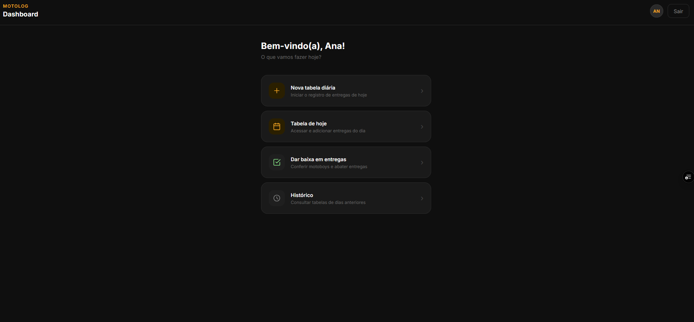

# MotoLog 🛵

> Aplicação web para registro e controle de entregas de motoboy, desenvolvida com Next.js, React.js, TypeScript, Tailwind CSS e Supabase. Substituindo papel e caneta por um sistema digital com autenticação, CRUD completo e histórico por dia.

### ✨ [Veja o projeto ao vivo aqui!](https://motolog-delivery-management.vercel.app/login)

---

### 📸 Screenshot

---

### 📖 Sobre o Projeto

No trabalho como operadora de caixa, o controle de entregas era feito à mão em papel — anotando horário, valor, forma de pagamento e qual motoboy acertou cada entrega. Decidi automatizar esse processo como projeto prático para aprender desenvolvimento full-stack.

O MotoLog permite registrar entregas do dia, consultar o histórico de dias anteriores, marcar acertos com motoboys e dar baixa nas entregas de forma rápida e visual.

---

### 🚀 Tecnologias Utilizadas

- Next.js 14 (App Router)
- React.js
- TypeScript
- Tailwind CSS
- Supabase (banco de dados PostgreSQL + autenticação)

---

### 🎮 Funcionalidades

- **Autenticação** — login e cadastro com Supabase Auth
- **Nova tabela diária** — uma tabela por dia, com bloqueio de duplicatas
- **Registro de entregas** — operador, horário, valor, forma de pagamento, troco e receita
- **Tabela de hoje** — visualização e edição das entregas do dia em tempo real
- **Histórico** — consulta de tabelas de dias anteriores com edição
- **Dar baixa** — visualização compacta focada em horário, valor, forma de pagamento e motoboy para agilizar baixas no sistema da empresa
- **Status visual** — cards verdes para entregas confirmadas com motoboy, vermelhos para canceladas
- **CRUD completo** — editar, cancelar e deletar entregas com confirmação

---

### 🧠 Aprendizados

- Estruturação de banco de dados relacional com PostgreSQL via Supabase
- Row Level Security (RLS) para controle de acesso por usuário
- Roteamento dinâmico com App Router do Next.js
- Tipagem estática com TypeScript em componentes React e chamadas ao Supabase
- Componentização reutilizável (ex: `ListaDias` compartilhado entre histórico e dar baixa)
- Gerenciamento de estado local com `useState` e `useEffect`
- Operações de CRUD com o cliente Supabase no lado do cliente

---

### 🐛 Desafios e Soluções

- **`invalid input syntax for type uuid: "hoje"`** — ao clicar em "Nova tabela diária" ou "Tabela de hoje", o app navegava para `/tabela/nova` e `/tabela/hoje` usando strings literais na URL. Quando a tela de nova entrega tentava salvar, o campo `tabela_id` chegava como `"hoje"` para o Supabase, que rejeitava por não ser um UUID válido. Resolvido criando as funções `handleNovaTabela` e `handleTabelaHoje` no dashboard, que primeiro fazem uma operação real no Supabase — inserindo ou buscando um registro em `tabelas_diarias` — e só então navegam para `/tabela/[uuid-real]`. O botão "Tabela de hoje" também ganhou lógica de upsert para evitar duplicatas.
- **Tabelas diárias duplicadas** — sem proteção, clicar várias vezes em "Nova tabela diária" criava múltiplos registros para o mesmo dia. Resolvido verificando se já existe uma tabela com a data de hoje antes de inserir, e exibindo um aviso caso já exista.

---

### 🗄️ Estrutura do Banco de Dados

- **profiles** — dados do usuário (nome, role, número de motoboy)
- **tabelas_diarias** — uma tabela por dia por operador
- **entregas** — entregas vinculadas a uma tabela diária

---

© 2026 Ana Ananias. Todos os direitos reservados.